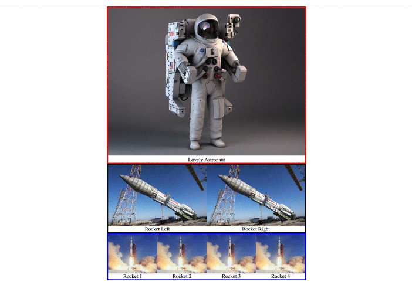

**Author**: [@njsfield](https://github.com/njsfield)  
**Maintainer**: [@njsfield](https://github.com/njsfield)

# CSS Gallery Challenge




# Setup

1. First, clone this repo
```
$ git clone https://github.com/njsfield/css-gallery-challenge.git
```
2. Open the project in your text editor (If you have brackets installed, I'd recommend using it for this challenge to preview CSS changes in real time. If you don't have it installed, I'd recommend using your preferred text editor and then making/previewing changes in Chrome's Dev Tools panel)
3. Read through through the comments in the index.html file
4. Try your best to solve the problems outlined in less than 1 hour.
3. Have fun! :)
